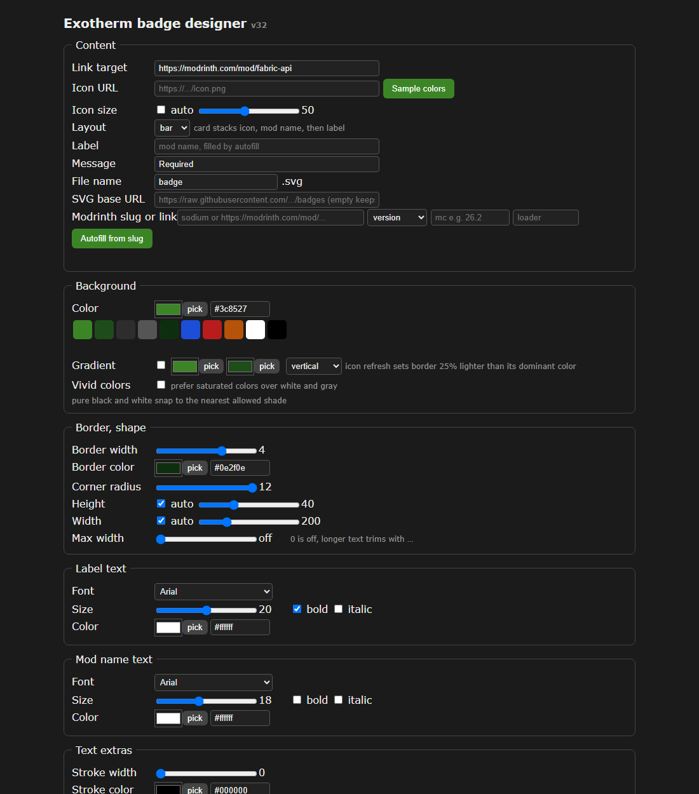

# Exotherm badge designer

Design badges for Minecraft mod listings. Paste any public Modrinth mod link, style the badge, copy the markdown.

## Use it

Open `https://hwdgaf.github.io/Badge-Maker/` and:

1. Paste a Modrinth mod link and wait a second while name, icon, and colors fill in.
2. Style it: layout, colors, fonts, borders, positions. The preview floats and updates live.
3. Send it straight to the Modrinth project gallery, or download the SVG and copy the markdown.

No installs, no account, no server. The page runs entirely in the browser.

## What it does

- Fills name, version, icon, and link from any public Modrinth project
- Samples colors from the icon, with clickable candidate swatches
- 2000+ open webfonts plus your own uploads, embedded on request
- Bar and card layouts, gradients, borders, per-line type with bold and italic
- Floating live preview, eyedropper on every color, icon and text nudging
- Auto width, height, and max-width trimming with ellipsis
- Outputs a standalone SVG plus link-wrapped markdown
- Sends the badge straight to the Modrinth project gallery or any GitHub repo, no download needed

## Needs internet for

Modrinth autofill, webfont search, hotlinked icons. Everything else runs offline. The eyedropper needs Chrome or Edge.

## Tokens for one-click publishing

Both stay in the page memory only and are never saved anywhere.

**GitHub token for Send to repo.** Profile photo, Settings, Developer settings at the bottom left, Personal access tokens, Tokens (classic), Generate new token (classic). Name it `badge-designer`, set an expiry, check the **repo** box for Contents write access. Copy it immediately, it shows exactly once.

**Modrinth token for Send to gallery.** Avatar, Settings, Personal access tokens (`modrinth.com/settings/pats`). Create one with project write scope and copy it.

## Files

- `designer.html` — the app, one file
- `make-badge.py` — command-line twin, Python 3 with stdlib only
- `designer-link.txt` — the whole app as one paste-in-address-bar link
- `samples/` — ready-made badges with copy-paste markdown

## License

MIT, copyright hwdgaf 2026. The full text sits in the header of `designer.html`.
